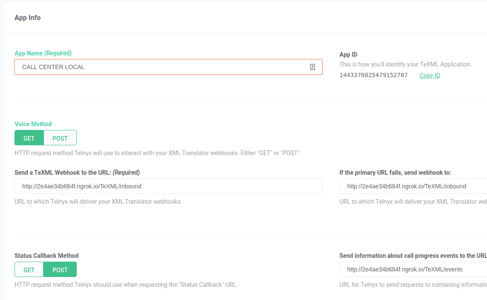
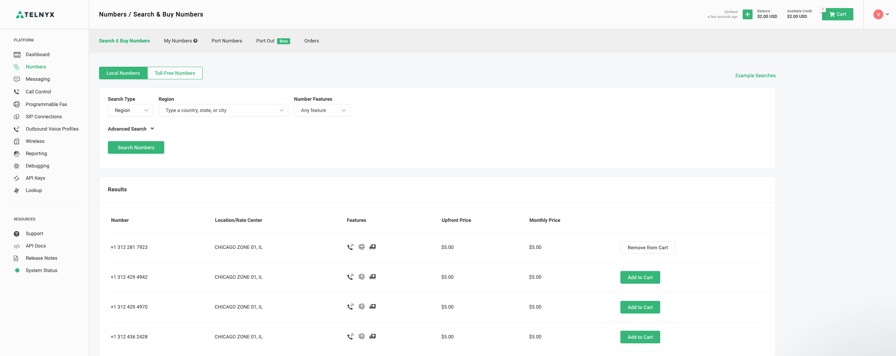
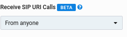
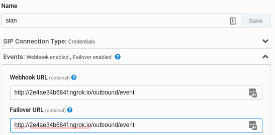
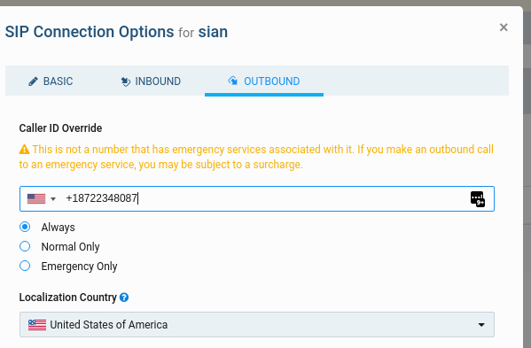

# Aiohttp & TeXML Call Center Solution

## Introduction

This is an example of a call center application built using an Aiohttp Python based server, which leverages [Telnyx's TeXML Translator](https://telnyx.com/texml-translator) product. 

The application will accept calls to a Telnyx number and then forward the call to all the credential SIP Connection associated with your outbound voice profile that you create. It does this through SIP URI calling, where the agents are required to register to our [SIP Proxies](https://sip.telnyx.com/) in order to receive the calls.

Two attempts will be made to dial the agents credential SIP Connections. If both attempts fail to be answered by the agents, a voicemail prompt will trigger should the caller wish to leave a voicemail.

## How to get started

You will be required to configure your Telnyx Mission Control Portal account first, then setup and run the call center application in your preferred environment. 

## Quick start

In this guide, you’ll learn how to get started with the Call Center App by using Telnyx SDKs and the Telnyx Portal. Just follow these steps:

1. Sign Up for a Telnyx Mission Control Portal Account
2. Create a Telnyx API Key
3. Install Ngrok
4. Create a Telnyx TeXML Application
5. Buy a phone number
6. Create your agents credential based SIP Connections
7. Create an outbound voice profile and associate all the SIP Connections
8. Set up your virtual environment
9. Run Setup and configure variables
10. Configure your Answer XML file

---

#### Step 1: Sign Up for a Telnyx Mission Control Portal Account

Navigate to our sign up page [telnyx.com/sign-up](https://telnyx.com/sign-up) to create your free Telnyx account.

Once logged in, you will have access to your Mission Control Portal where you can buy phone numbers, set up and manage your TeXML application, and more.

#### Step 2: Create a Telnyx API Key

Your Telnyx API Key can be created on the API Keys [page](https://portal.telnyx.com/#/app/api-keys) of your Mission Control Portal account. This key will allow this application permission to make the necessary requests to our API endpoints. 

#### Step 3: Install Ngrok

Download and install [ngrok](https://ngrok.com/).

Start up ngrok with `ngrok http 8080` and make note of the https `Forwarding` URL.

You will need it to be able to receive requests from the TeXML application.

#### Step 4: Create a Telnyx TeXML Application

Setup and configure your [TeXML application](https://portal.telnyx.com/#/app/call-control/texml) 

Set the Voice Method to GET and put the url: ngrok_forwarding_url + /TeXML/inbound. E.g. https://b06b087392cd.ngrok.io/TeXML/inbound

Set the Status Callback Method to 'POST' amd enter the url: ngrok_forwarding_url + /TeXML/events. E.g. https://b06b087392cd.ngrok.io/TeXML/events

**E.g**

#### 

#### Step 5: Buy a phone number

Access the Telnyx Mission Control Portal and [buy a phone number](https://portal.telnyx.com/#/app/numbers/search-numbers).

At checkout, use the drop-down box labelled **Connection or Application** to select the application you just created. This associates your new phone number with the application.

This is your TeXML Call Center phone number that end users will call to reach your application.

#### 

#### Step 6. Create your agents credential based SIP Connections

Setup your SIP connections. Set the username to be something unique and representative of the agent you will assign the connection to. 

In the inbound section, enable 'Recieve SIP URI Calls' to 'From anyone'. 

Next, you will need to add the ngrok forwarding url you got from Step 3.  

**E.g**

ngrok_forwarding_url + /outbound/event 

This form can be found under basic -> Events -> Webhook url.

Lastly, for when your agents make outbound calls, you may want to enable a caller ID override which enables Telnyx to send out a specific caller ID for each agent.

You can do this on the connections outbound settings.

#### Step 7. Create an outbound voice profile and associate all the SIP Connections

Setting up an outbound profile is pretty simple and allows all the SIP Connections associated to it to be able to make outbound calls through our network. 

Guide on setting up an outbound voice profile can be found [here](https://support.telnyx.com/en/articles/4320411-outbound-voice-profiles). 

Please take note of the profile ID as you will need this for your environment file.

#### Step 8. Set up virtual your virtual environment

You may choose your preferred virtual environment. In our setup, we will be using [pipenv](https://pypi.org/project/pipenv/)

Install with command:

`pip install pipenv`

In call-center-texml directory run:

`pipenv shell`

and then

`pipenv update`

This will create the environment and install the application requirements in the pipfile.

#### Step 9. Run Setup and configure variables

In the call-center-texml directory, run the following command: 

``python setup.py``

This will create the .env file within the call-center directory.
Open this .env file and fill in the required variables.

**API_KEY:** This is your Telnyx API Key available [here](https://portal.telnyx.com/#/app/api-keys). 

**PROD:** Defaults to True. You can set this to either True or False. If set to True, the scheduled jobs for updating connections and sending balance notifications will run in intervals.  

**SLACK_URL:** The Slack url will be found on the slack app for incoming webhooks. More on setting up Slack API integrations can be found [at Slack's documentation](https://api.slack.com/messaging/webhooks). 

Note: The slack_url can be left blank if slack is not being used.

**NGROK_URL:** For the project you will need ngrok installed and running. Grab the forwarding url you got from Step 3 and place here.

**OUTBOUND_PROFILE_ID:** This is the ID of the outbound profile, from Step 7, assigned to your SIP connections. It's used to know what SIP connections to utilize for connecting the callers calls to your agents.

Save this file. If these are correct, you should now have everthing you need to run the application.

#### Step 10. Configure your Answer XML file

On the condition that the agent hangs up first, when they have finished a call with the caller, you are welcome to handle this in any way you chose.

You can specify this in your answer.xml file. A `say` is specified for now, where the caller will hear Alice thanking the caller for dialing in before ending the call. If you have an IVR, you may want instead use `dial` which could send the caller back to the IVR, should they wish to have a conversation with another department.

---

## Running The Application

Use the following command to execute the application:

``PYTHONPATH=`pwd`/ python call_center/main.py``

You will now see the application running on localhost port 8080 and can test your call center application by dialing the number you purchased from Step 5.

The TeXML application will answer the call and inform the caller that they are now attempting to connect them to an available agent. At this point, the clients the agents used to register their SIP Connections credentials will start to ring if they are available.

## Optional: Setting up Audio files

Currently, the XML files are configured to serve a 'say' to tell the dialer what is happening. 

However, the server is set up for delivering audio files for things like: initial greeting, 'please stay on hold' and a 'please leave a voicemail' message.

All you need to do is record the audio and place them in in the sub-directory audio.

They should be named:

1. greeting.mp3
2. busy_try_again.mp3
3. voicemail.mp3 

Then un-comment the <play> verbs that are in the busy_template, inbound_template and voicemail XML files.

E.g <Play>{ngrok_url}/TeXML/support_busy</Play>

Then remove the `say`'s and the TeXML will look for the audio files instead of the say.

You can also specify a recording status call back url in the voicemail.xml file. Once a call had ended, Telnyx's TeXML server will send a POST request with the url of the recorded file to the url you specified. 

## Follow-ups & Next Steps

[TeXML Docs](https://developers.telnyx.com/docs/api/v2/call-control/TeXML-Translator)\
[Ngrok Tutorial](https://developers.telnyx.com/docs/v2/development/ngrok)\
[Python Aiohttp](https://docs.aiohttp.org/en/stable/)
