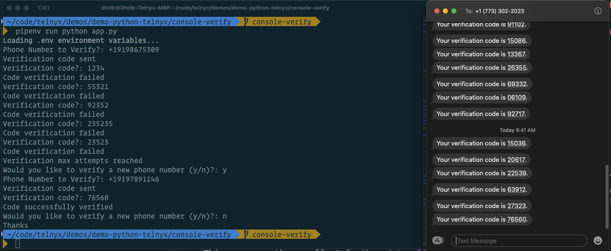

<div align="center">

# Telnyx-Python Verify Console Example


Sample application demonstrating Telnyx-Python Verify

</div>

## Documentation & Tutorial

The full documentation and tutorial is available on [developers.telnyx.com](https://developers.telnyx.com/docs/v2/development/dev-env-setup?lang=dotnet&utm_source=referral&utm_medium=github_referral&utm_campaign=cross-site-link)

## Pre-Reqs

You will need to set up:

* [Telnyx Account](https://telnyx.com/sign-up?utm_source=referral&utm_medium=github_referral&utm_campaign=cross-site-link)
* [Telnyx Verify Profile](https://portal.telnyx.com/#/app/verify/profiles)
* [Python and PIP](https://developers.telnyx.com/docs/v2/development/dev-env-setup?lang=python) installed

## What you can do

* Console application to send and verify a code to a phone number



## Usage

The following environmental variables need to be set

| Variable               | Description                                                                                                                                              |
|:-----------------------|:---------------------------------------------------------------------------------------------------------------------------------------------------------|
| `TELNYX_API_KEY`       | Your [Telnyx API Key](https://portal.telnyx.com/#/app/api-keys?utm_source=referral&utm_medium=github_referral&utm_campaign=cross-site-link)              |
| `VERIFY_PROFILE_ID`    | Your [Telnyx Verification Profile ID](https://portal.telnyx.com/#/app/verify/profiles) |

### .env file

This app uses the excellent [python-dotenv](https://github.com/theskumar/python-dotenv) package to manage environment variables.

Make a copy of [`.env.sample`](./.env.sample) and save as `.env` and update the variables to match your creds.

```
TELNYX_API_KEY=KEY0...R1LI
VERIFY_PROFILE_ID=49000176-632d-c7de-9bda-209fbb66baad
```

### Install

Run the following commands to get started

```
$ git clone https://github.com/team-telnyx/demo-python-telnyx.git
$ cd demo-python-telnyx/console-verify
```

Install the dependencies:

```
pip install telnyx
pip install dotenv
```

### Run

Start the server `python app.py`

When the application is started: 
* Enter your phone number to send the verification code.
    * ⚠️ (**Note: You must enter phone number in E.164 format (i.e. +12345678910) for the code to be sent correctly.**)
* Receive the verification code
* Enter the code into the console app, you'll have 5 tries to get it right!
