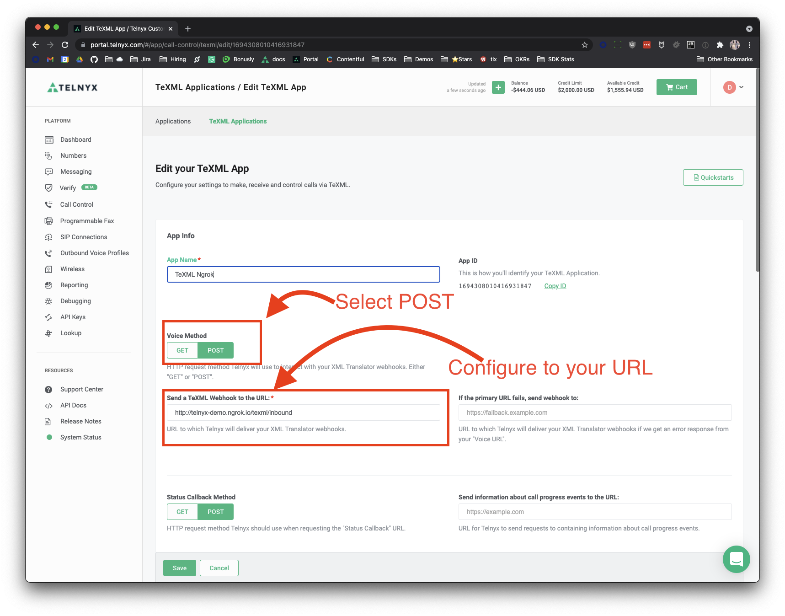

<div align="center">

# Telnyx-Python Simple TeXML Conference


Sample application demonstrating Telnyx TeXML Conference Capabilities


<a href="https://www.loom.com/share/cad42a5fe6734b58a8ab7e603fb218d0">
    <p>Flask Conference Call Demo - Watch Video</p>
    
  </a>
</div>

## Pre-Reqs

You will need to set up:

* [Telnyx Account](https://telnyx.com/sign-up?utm_source=referral&utm_medium=github_referral&utm_campaign=cross-site-link)
* [Telnyx Phone Number](https://portal.telnyx.com/#/app/numbers/my-numbers) enabled with:
    * [Telnyx Outbound Voice Profile](https://portal.telnyx.com/#/app/outbound-profiles)
    * [Telnyx TeXML Application](https://portal.telnyx.com/#/app/call-control/texml)
    * The Outbound Voice Profile and TeXML Application should be associated with each other.
* [Python and PIP/PipEnv](https://developers.telnyx.com/docs/v2/development/dev-env-setup?lang=python) installed

## What you can do

This app, when running has the following behavior for inbound and outbound calls:

Inbound:
* Receives inbound call
* Prompts user for 2-digit conference code
* Creates conference if does not exist
* Adds user to conference if does exist

## Usage

The following environmental variables need to be set

| Variable | Description                                             |
|:---------|:--------------------------------------------------------|
| `PORT`   | **Defaults to `8000`** The port the app will be served. |

### .env file

This app uses the excellent [python-dotenv](https://github.com/theskumar/python-dotenv) package to manage environment variables.

Make a copy of [`.env.sample`](./.env.sample) and save as `.env` and update the variables to match your creds.

```
PORT=8000
```

### Install

Run the following commands to get started

```
$ git clone https://github.com/team-telnyx/demo-python-telnyx.git
$ cd flask-texml-conference
$ pipenv install
$ pipenv run python main.py
```

### Ngrok

This application is served on the port defined in the runtime environment (or in the `.env` file). Be sure to launch [ngrok](https://developers.telnyx.com/docs/v2/development/ngrok?utm_source=referral&utm_medium=github_referral&utm_campaign=cross-site-link) for that port

```
./ngrok http 8000
```

> Terminal should look _something_ like

```
ngrok by @inconshreveable                                                                                                                               (Ctrl+C to quit)

Session Status                online
Account                       Little Bobby Tables (Plan: Free)
Version                       2.3.35
Region                        United States (us)
Web Interface                 http://127.0.0.1:4040
Forwarding                    http://your-url.ngrok.io -> http://localhost:8000
Forwarding                    https://your-url.ngrok.io -> http://localhost:8000

Connections                   ttl     opn     rt1     rt5     p50     p90
                              0       0       0.00    0.00    0.00    0.00
```

At this point you can point your [TeXML Application](https://portal.telnyx.com/#/app/call-control/texml) to generated ngrok URL + path and Select **POST** as the Voice Method (Example: `http://{your-url}.ngrok.io/texml/inbound`).

#### Screen Shot

Your TeXML Application should look similar to the following screenshot




### Run with Ngrok & Portal Setup

Start the server `$ pipenv run python main.py`

When the application is started, flask serves it to the port specified in the .env file (Default 8000).

Once everything is setup, you should now be able to:
* Make call to a specified number
* Enter digits to join or create a conference
* Make another call to the number and enter the same two digits to be connected
