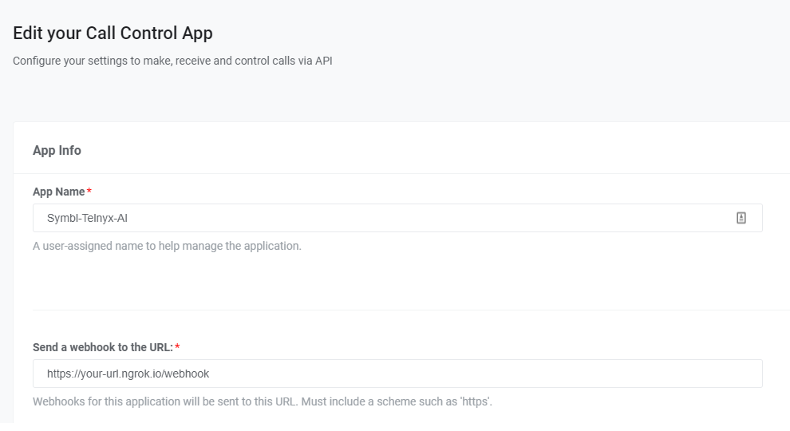

<div align="center">

# Telnyx & Symbl.ai : CI Enabled Transfers On Calls


This sample application not only implements automation features on a telephony based call using Telnyx Call Control, but it also recognizes and acts on conversation sentiment to transfer and route calls directly to specific numbers by parsing data collected from Symbl.ai.   
	
</div>

# Objective
## Telnyx Voice API Intelligent Transfers to Live Operator with Symbl.ai in a Python Flask App with an IVR/AVR 

## Schematic on the Technology Used:
Telnyx built an application based on its Voice API technologies for configuring a Python bot to route calls. Adding Symbl.ai to the application enables developers to add conversation intelligence to conversational intelligence.  

## Documentation

The full documentation will be available on [developers.telnyx.com]

## Pre-Reqs
What you will need to set up on the Telnyx Side:

* [Telnyx Account](https://telnyx.com/sign-up?utm_source=referral&utm_medium=github_referral&utm_campaign=cross-site-link)
* [Telnyx Call Control Application](https://portal.telnyx.com/#/app/call-control/applications)
* [Python and PIP](https://developers.telnyx.com/docs/v2/development/dev-env-setup?lang=python) installed
* Ability to receive webhooks (with something like [ngrok](https://developers.telnyx.com/docs/v2/development/ngrok?utm_source=referral&utm_medium=github_referral&utm_campaign=cross-site-link))


What you will need to set up on the Symbl Side:
* [Symbl Account](https://telnyx.com/sign-up?utm_source=referral&utm_medium=github_referral&utm_campaign=cross-site-link)


## What you can do

* Set up a phone number to call into to set up a mock "IVR' center utilizing Telnyx Conference Call Control
* Based on sentiment analysis provided by Symbl, choose to transfer the call from the IVR to a live operator

## Usage

### .env file

This app uses the excellent [python-dotenv](https://github.com/theskumar/python-dotenv) package to manage environment variables.

Make a copy of [`.env.sample`](./.env.sample) and save as `.env` and update the variables to match your creds.

```
# remove .sample from file name
TELNYX_API_KEY=""
TELNYX_PUBLIC_KEY=""
CONNECTION_ID=""
PORT_NUMBER=8000
```

### symbl.conf
From symbl.ai sign up page, insert your app_id and app_secret. Once you sign up for an account mentioned in the Pre-Reqs above, the front page will give you the required details.

```
# remove .sample from file name
[credentials]
app_id= #Your Symbl.ai appId 
app_secret= #Your Symbl.ai appSecret 
```

### Callback URLs For Telnyx Applications

| Callback Type                    | URL                              |
|:---------------------------------|:---------------------------------|
| Inbound Call-Control Callback  | `{ngrok-url}/webhook`  |

This URL is needed to be 

## Installation

### Environment Setup


#### Dependencies

This package relies on some very nice external dependencies and modules. The specific ones can be found in the Pipfile. 
To make this easier we are using `pipenv` to manage all of our packaging needs. To utilize this amazing tool, make sure you have `pip` installed, then run `pip install pipenv` 

Afterwards, simply run `pipenv install` to automatically install all the required packages that are needed.

#### Ngrok

This application is served on the port defined in the runtime environment (or in the `.env` file). Be sure to launch [ngrok](https://developers.telnyx.com/docs/v2/development/ngrok?utm_source=referral&utm_medium=github_referral&utm_campaign=cross-site-link) for that port
```
./ngrok http 8000
```

> Terminal should look _something_ like

```
ngrok by @inconshreveable                                                                                                                               (Ctrl+C to quit)

Session Status                online
Account                       Little Bobby Tables (Plan: Free)
Version                       2.3.35
Region                        United States (us)
Web Interface                 http://127.0.0.1:4040
Forwarding                    http://your-url.ngrok.io -> http://localhost:8000
Forwarding                    https://your-url.ngrok.io -> http://localhost:8000

Connections                   ttl     opn     rt1     rt5     p50     p90
                              0       0       0.00    0.00    0.00    0.00
```

At this point you can point your Call Control application (located [here](https://portal.telnyx.com/#/app/call-control/applications)) to the generated ngrok URL + path  (Example: `http://{your-url}.ngrok.io/Webhook`).

### Telnyx Setup

<details>
<summary><strong>Step-by-step instructions</strong> (expand for details)</summary><p>

1. Follow the instructions located here for call control setup: https://developers.telnyx.com/docs/v2/call-control/quickstart

2. For the webhook URL that is referenced in the above guide, we will need to replace that with our custom ngrok url that would be generated. (ie. <https://your-url.ngrok.io> ). Since our app.route is targeting "/webhook", we will need to append that to the ngrok url, so it will look something like this https://your-url.ngrok.io/webhook

     


3. Take note of the Call Control ID that is located on the same page as from above. This will serve as the "CONNECTION_ID" that is referenced in the .env file. Click on the API Keys tab on the left and jot down both "Telnyx API Key" and the "Telnyx Public Key" that are located there. To summarize, you will need:
* CONNECTION_ID (this is your Call Control app ID)
* TELNYX_API_KEY (this is found on the API Keys tab on the left of the portal page)
* TELNYX_PUBLIC_KEY (this is found on the API Keys tab on the left of the portal page)

4. You're good to go!

</details>

### Symbl Portal Setup
In the [Portal](https://platform.symbl.ai/)
* Jot down your App ID Credentials and App Secret

### Run
Before you're able to run the application, you will need to set up some variables. Reference Installation from above.

You will also need to fill out these variables in the conference.py file:
* transfer_number = ```This is  the number you want the initial caller ("customer") to be transfered to after his sentiment value gets too low```
* conference_number = ```This is the number that you have assigned your Call Control ID (ie. The number that is being called into)```
* conference_name = ```Any name that you wish to call your Conference to establish where everything should join towards ```

#### Start the server

Start the server `conference.py`

When the application is started, flask serves it to the port specified in the .env file (Default 8000)

When you place a call towards the number you specified in conference.py (the number that you set your IVR application to point to), the program will do the rest to route the call. 

Once you reach the IVR, exemplified by the text-to-speech talking on the line, you can start saying phrases for Symbl.ai to parse through. Once the AI finds a phrase that the caller/customer has spoken that it determines to be "negative" (Link here for more information), the call with send a forward and initiate a call request to an "operator".

If an operator joins the call, it will automatically join his conference to provide service to him. Hanging up will terminate the session.

## Long Form Tutorial (Step by Step)
<details>
<summary><strong>Step-By-Step Instruction on Creating the basic Conference using Telnyx</strong> (expand for details)</summary><p>
## Introduction

The [Call Control framework](/docs/api/v2/call-control) is a set of APIs that allow complete control of a call flow from the moment a call begins to the moment it is completed. In between, you will receive a number of [webhooks](/docs/v2/call-control/receiving-webhooks) for each step of the call, allowing you to act on these events and send commands using the Telnyx Library. A subset of the operations available in the Call Control API is the [Call Control Conference](/docs/api/v2/call-control/Conference-Commands) API. This allows the user (you) to create and manage a conference programmatically upon receiving an incoming call, or when initiating an outgoing call.


The [Telnyx Python Library](https://github.com/team-telnyx/telnyx-python) is a convenient wrapper around the Telnyx REST API. It allows you to access and control call flows using an intuitive object-oriented library. This tutorial will walk you through creating a simple Flask and Ngrok server application that allows you to create and manage a conference.

## Setup

Before you get started, you’ll need set up a Mission Control Portal account, buy a number and connect that number to a [Call Control Application](https://portal.telnyx.com/#/app/call-control/applications). You can learn how to do that in the [quickstart guide](/docs/v2/call-control/quickstart).

* make sure the *Webhook API Version* is **API v2**

You’ll also need to have `python` installed to continue. You can check this by running the following:

```bash
$ python3 -v
```

Now in order to receive the necessary webhooks for our IVR, we will need to set up a server. For this tutorial, we will be using [Flask](https://palletsprojects.com/p/flask/), a micro web server framework. A quickstart guide to flask can be found on their official website. For now, we will install flask using pip.

```bash
$ pip install flask
```

You can get the full set of available Telnyx Call Control Commands [here](/docs/api/v2/overview).
You can also find the Conference Commands [here](https://developers.telnyx.com/docs/api/v2/call-control/Conference-Commands)

For each Telnyx Call Control Command we will be using the Telnyx Python SDK. To execute this API we are using Python `telnyx`, so make sure you have it installed. If not you can install it with the following command:

```bash
$ pip install telnyx
```

After that you’ll be able to use ‘telnyx’ as part of your app code as follows:

```python
import telnyx
```

We will also import Flask in our application as follows:

```python
from flask import Flask, request, Response
```

And set our api key using the Python telnyx SDK:

```python
telnyx.api_key = "YOUR_TELNYX_API_KEY"
```

## Server and Webhook setup

Flask is a great application for setting up local servers. However, in order to make our code public to be able to receive webhooks from Telnyx, we are going to need to use a tool called ngrok. Installation instructions can be found [here](https://developers.telnyx.com/docs/v2/development/ngrok). 

Now to begin our flask application, underneath the import and setup lines detailed above, we will add the following:

```python
app = Flask(__name__)
 
@app.route('/webhook', methods=['POST'])
def respond():
	//Our code for handling the call control application will go here
	print(request.json[‘data’])
return Response(status=200)
```

This is the base Flask application code specified by their [documentation](https://palletsprojects.com/p/flask/). This is the minimum setup required to receive webhooks and manipulate the information received in json format. To complete our setup, we must run the following to set up the Flask environment (note YOUR_FILE_NAME will be whatever you .py file is named):

```bash
$ export FLASK_APP=YOUR_FILE_NAME.py
```

Now, we are ready to serve up our application to our local server. To do this, run:

```bash
$ flash run
```

A successful output log should look something like:

```bash
 * Serving Flask app "main"
 * Running on http://127.0.0.1:5000/ (Press CTRL+C to quit)
```

Now that our Flask application is running on our local server, we can use ngrok to make this public to receive webhooks from Telnyx by running the following command wherever the ngrok executable is located (NOTE you may have to open another terminal window or push the Flask process to the background):

```bash
$ ./ngrok http 5000
```

Once this is up and running, you should see the output URL in the command logs or located on the [ngrok dashboard page](https://dashboard.ngrok.com/status/tunnels). This url is important because it will be where our Call Control Application will be sending webhooks to. Grab this url and head on over to the Telnyx Dashboard page. Navigate to your Call Control Application and add the URL to the section labeled "Send a webhook to the URL" as shown below. Add the ngrok url to that section and we are all set up to start our IVR!

**Ensure that you append '/webhook' to the ngrok url as specified in our Flask Application**


## Receiving and Interpreting Webhooks

We will be configuring our respond function to handle certain incoming webhooks and execute call control commands based on what the values are. Flask catches the incoming webhooks and calls the respond() function every time a webhook is sent to the route we specified as ‘/webhook’. We can see the json value of the hook in the request.json object. Here is what a basic Telnyx Call Object looks like

```json
{
	'data': {
		'event_type': 'call.initiated',
		'id': 'a2fa3fa6-4e8c-492d-a7a6-1573b62d0c56',
		'occurred_at': '2020-07-10T05:08:59.668179Z',
		'payload': {
			'call_control_id': 'v2:rcSQADuW8cD1Ud1O0YVbFROiQ0_whGi3aHtpnbi_d34Hh6ELKvLZ3Q',
			'call_leg_id': '76b31010-c26b-11ea-8dd4-02420a0f6468',
			'call_session_id': '76b31ed4-c26b-11ea-a811-02420a0f6468',
			'caller_id_name': '+17578390228',
			'client_state': None,
			'connection_id': '1385617721416222081',
			'direction': 'incoming',
			'from': '+14234567891',
			'start_time': '2020-07-10T05:08:59.668179Z',
			'state': 'parked',
			'to': '+12624755500'
		},
		'record_type': 'event'
	},
	'meta': {
		'attempt': 1,
		'delivered_to': 'http://59d6dec27771.ngrok.io/webhook'
	}
}
```

We want to first check and see if the incoming webhook is an event. To check that, we need to look at the record_type using the following check:

```python
def respond():
	//Check record_type of object
	data = request.json['data']
    	if data.get('record_type') == 'event':
 
	print(request.json[‘data’])
return Response(status=200)
```

Then, we can check and see what kind of event it is. In the case of the example json above, the event is call.initiated. We can get that value using the following added code:

```python
def respond():
	//Check record_type of object
	data = request.json['data']
    	if data.get('record_type') == 'event':
		//Check event type
		event = data.get('event_type')
        	print(event, flush=True)
        	if event == "call.initiated":
            	print("Incoming call", flush=True)
 
	print(request.json[‘data’])
return Response(status=200)
```

As you can see, this check will print out “incoming call” whenever a call.initiated event is received by our application. We can even test it by giving the Phone Number associated with our Call Control Application a call! Now we can start to implement some commands in response to this webhook.

## Receiving Webhooks & Creating a Conference

Below is the logic that will go inside our respond() function. When we receive a webhook, we extract the data from `request.json.get('data')` and we look at the `event_type` inside that object to determine a course of action.

```python
calls = []
conference = None

class call_info:
    call_control_id: ''
    call_leg_id: ''

@app.route('/webhook', methods=['POST'])
def respond():

    # Activate global calls array
    global calls
    global conference

    # Get the data from the request
    data = request.json.get('data')
    # Check record_type
    if data.get('record_type') == 'event':
        # Check event type
        event = data.get('event_type')
        if event == "call.initiated":
            # Extract call information and store it in a new call_info() object
            new_call = call_info()
            new_call.call_control_id = data.get('payload').get('call_control_id')
            new_call.call_leg_id = data.get('payload').get('call_leg_id')
            calls.append(new_call)
            # Answer the call
            print(telnyx.Call.answer(new_call), flush=True)

        # When the call is answered, find the stored call and either add it 
        # to the conference or create a new one if one is not yet created
        elif event == "call.answered":
            call_id = data.get('payload').get('call_control_id')
            call_created = call_info()
            call_created.call_control_id = call_id

            for call in calls:
                if call.call_control_id == call_id:
                    if not conference:
                        conference = telnyx.Conference.create(beep_enabled="always",call_control_id=call_id, name="demo-conference")
                    else:
                        conference.join(call_control_id=call_id)
        
        # When a caller hangs up, remove that caller from the global calls array
        elif event == "call.hangup":
            call_id = data.get('payload').get('call_leg_id')
            for call in calls:
                if call.call_leg_id == call_id:
                    calls.remove(call)
    return Response(status=200)
```

Pat youself on the back - that's a lot of code to go through! Now let's break it down even further and explain what it does. First, create an array for keeping track of the ongoing calls and define a variable for storing the conference object. Then, we create a small object class for call_info, containing the call_control_id and call_leg_id. This will be useful for searching for calls in our calls array later, as well as using Conference Commands with those objects.

```python
calls = []
conference = None

class call_info:
    call_control_id: ''
    call_leg_id: ''
```

Next, we parse the data from our webhook in the respond() function. We first declare our global variables inside of the function so that the scope is consistent. Then, we extract the data from the reponse and check to ensure the `record_type` is `event`. Then, we extract the `event_type` itself and use logic to determine the action taken based on the `event`.

```python
@app.route('/webhook', methods=['POST'])
def respond():
    # Activate global calls array
    global calls
    global conference
    # Get the data from the request
    data = request.json.get('data')
    #print(data, flush=True) #For testing purposes, you could print out the data object received
    # Check record_type
    if data.get('record_type') == 'event':
        # Check event type
        event = data.get('event_type')
```

Here is where you will respond to a new call being initiated, which can be from either an inbound or outbound call. We create a new call_info() object and assign the `call_control_id` and `call_leg_id` from the incoming data. We then use `telnyx.Call.answer(new_call)` to answer the call. This will trigger a webhook event `call.answered` which we will handle below.

```python
# When call is initiated, create the new call object and add it to the calls array
        if event == "call.initiated":
            # Extract call information and store it in a new call_info() object
            new_call = call_info()
            new_call.call_control_id = data.get('payload').get('call_control_id')
            new_call.call_leg_id = data.get('payload').get('call_leg_id')
            calls.append(new_call)
            # Answer the call
            print(telnyx.Call.answer(new_call), flush=True)
```

On the `call.answered` event, retrieve the stored call created during the `call.initiated` event. Then, either create a new conference if this is the first call and there isn't a conference running yet, or add the call to an existing conference. Note that a `call_control_id` is required to start a conference, so there must aready be an existing call before you can create a conference, which is why we create the conference here.

```ruby
# When the call is answered, find the stored call and either add it 
        # to the conference or create a new one if one is not yet created
        elif event == "call.answered":
            call_id = data.get('payload').get('call_control_id')
            call_created = call_info()
            call_created.call_control_id = call_id

            for call in calls:
                if call.call_control_id == call_id:
                    if not conference:
                        conference = telnyx.Conference.create(beep_enabled="always",call_control_id=call_id, name="demo-conference")
                    else:
                        conference.join(call_control_id=call_id)
```

And finally, when a call ends we remove it from the active call list.

```python
# When a caller hangs up, remove that caller from the global calls array
        elif event == "call.hangup":
            call_id = data.get('payload').get('call_leg_id')
            for call in calls:
                if call.call_leg_id == call_id:
                    calls.remove(call)
```

## Conclusion
</details>


<details>
<summary><strong>Symbl.AI Integration</strong> (expand for details)</summary><p>
Symbl.AI is 

## Setup
Before we get started with adding on more code, we will need to get some API credentials from symbl.ai's page: https://platform.symbl.ai/#/home

Take note of both App ID and App Secret

As before, we will now want to install Symbl:
```bash
$ pip install symbl
```

A full complete list of Symbl.ai's full SDK capabilities can be located [here](https://docs.symbl.ai/docs/python-sdk/overview).

From here, we will be adding on to the conference section with some logic involving IVR fundamentals and the Symbl.ai integration. To make the most sense, we will post the entire code block and work from there: 

```python
import os
import base64
import threading
import time

from flask import Flask, request, Response
from dotenv import load_dotenv

import telnyx
import symbl

app = Flask(__name__)

# Fill these in with your required params
transfer_number = os.getenv('TRANSFER_NUMBER')    # number of live operator to transfer to
conference_number = os.getenv('CONFERENCE_NUMBER')   # number that's tied to your call control application
conference_name = os.getenv('CONFERENCE_NAME')
symbl_number = os.getenv('SYMBL_NUMBER')   # should be left unchanged, constant number of Symbl for incomming PSTN calls

calls = []
conference = None
customer = ""
customer_call_control_id = ""
customer_call = telnyx.Call()
first_call=True
connection_object = ""
conversation_id = ""

class call_info():
    pass

class my_IVR_info:
    call_control_id_customer = ""
    client_state = ""

@app.route('/webhook', methods=['POST'])
# Our code for handling the call control application goes here! 
def respond():

    # Activate global arrays
    global calls
    global conference
    global customer_call_control_id
    global my_IVR_info
    global customer_call
    global first_call
    # Get the data from the request
    data = request.json.get('data')
    #print(data, flush=True) #For testing purposes, you could print out the data object received

    # Check record_type
    # Find out how to return 200 after symbl() initiates call

    if data.get('record_type') == 'event':
        # Check event type
        event = data.get('event_type')
        # print(event, flush=True) #For testing purposes you can print out the event if you'd like

        
                # When call is initiated, create the new call object and add it to the calls array
        if event == "call.initiated":
            # Extract call information and store it in a new call_info() object
            new_call = call_info()
            new_call.call_control_id = data.get('payload').get('call_control_id')
            new_call.call_leg_id = data.get('payload').get('call_leg_id')
            new_call.direction = data.get('payload').get('direction')
            new_call.phone_number = data.get('payload').get('from')
            calls.append(new_call)
            # Seperate and keep track of symb versus other callers
            if new_call.direction == 'incoming' and new_call.phone_number != symbl_number and first_call == True:
                # We will initiate the call from symbl.ai and have it create the conference
                symbl()
                # Answer the call
                
                customer_call_control_id = data.get('payload').get('call_leg_id')
                client_state_message = "customer"
                encoded_client_state = base64.b64encode(client_state_message.encode('ascii'))
                client_state_str = str(encoded_client_state, 'utf-8')
                # Answer the call
                print(telnyx.Call.answer(new_call, client_state=client_state_str), flush=True)
                customer_call.call_control_id = customer_call_control_id
                customer_call.client_state_message = client_state_str
                first_call = False
            else:
                print(telnyx.Call.answer(new_call), flush=True)        
        # When the call is answered, find the stored call and either add it 
        # to the conference or create a new one if one is not yet created
        # Symbl calling in first will create this conference
        elif event == "call.answered":
            call_id = data.get('payload').get('call_control_id')
            call_created = call_info()
            call_created.call_control_id = call_id
            for call in calls:
                if call.call_control_id == call_id:
                    if not conference:
                        conference = telnyx.Conference.create(
                            call_control_id=call_id, 
                            name=conference_name)
                    else:
                        conference.join(
                            call_control_id=call_id, 
                            end_conference_on_exit=True)

        elif event == "conference.participant.joined":
            client_state = data.get('payload').get('client_state')
            if(client_state == "Y3VzdG9tZXI="):
                ivr()
                sentiment()     
                
        elif event == 'call.gather.ended':
            digits_pressed = data.get('payload').get('digits')
            if (digits_pressed == "1"):
                transfer ()
                print ("Transfering call via button press!")
            elif (digits_pressed == "2"):
                print ("Converting to Spanish!")
                
        elif event == "call.hangup":
            call_id = data.get('payload').get('call_leg_id')
            for call in calls:
                calls.remove(call)

    #print(request.json, flush=True); For testing purposes, you can print out the entire json received
    return Response(status=200)

# our transfer command
def transfer():
    connection_id = os.getenv('CONNECTION_ID')
    client_state = "outbound agent transfer"
    encoded_client_state = base64.b64encode(client_state.encode('ascii'))
    client_state_str = str(encoded_client_state, 'utf-8')
    telnyx.Call.create(
        connection_id=connection_id,
        to = transfer_number,
        from_ = conference_number,
        client_state = client_state_str
    )

# our simple ivr
def ivr():
    res = customer_call.gather_using_speak(
        payload='This is a very long string of nonsense. Press 1 to transfer. Press 2 to print something to console',
        language= 'en-US',
        voice = 'female',
    )

def symbl():
    global connection_object
    global conversation_id
    
    import symbl
    # symbl related variables, can optionally add paramaters/email transcript/etc
    phoneNumber = conference_number 
    meetingId = "" 
    password = "" 
    emailId = ""

    # call symble streaming API (telephony)
    connection_object = symbl.Telephony.start_pstn(
              credentials={'app_id': '5754496268696d715a576f4966786b683875494c7370507276614b3863584b66', 'app_secret': '4e37616c4b55734c7830483234554455524656572d6a304a4b7a6343633459355434635f726863787178727a447438354e626f5f5531364f4d4c773545666d31'},
        phone_number=phoneNumber,
        dtmf = ",,{}#,,{}#".format(meetingId, password),
        actions = [
            {
            "invokeOn": "stop",
            "name": "sendSummaryEmail",
            "parameters": {
                "emails": [
                emailId
                ],
            },
            },
        ]
    )
    def conversation_id():
        connection_object.conversation.get_conversation_id()
    
    
    #conversation_id = connection_object.conversation.get_conversation_id()
    print("Symbl has joined the call!")
    print(connection_object)
    print(conversation_id)
    print(connection_object.connectionId)

def sentiment():
    sentiment = connection_object.conversation.get_messages(parameters={'sentiment': True})
    print(sentiment)
    threading.Timer(1.0, sentiment).start()
        
if __name__ == '__main__':
    load_dotenv()
    telnyx.api_key = os.getenv('TELNYX_API_KEY')
    app.run(port = 5000)
```

Lets start with the beginning:

```python
# Fill these in with your required params
transfer_number = os.getenv('TRANSFER_NUMBER')    # number of live operator to transfer to
conference_number = os.getenv('CONFERENCE_NUMBER')   # number that's tied to your call control application
conference_name = os.getenv('CONFERENCE_NAME') # any name you desire to call the conference
symbl_number = os.getenv('SYMBL_NUMBER')   # should be left unchanged, constant number of Symbl for incomming PSTN calls

calls = []
conference = None
customer_call_control_id = ""
customer_call = telnyx.Call()
first_call=True
connection_object = ""
conversation_id = ""
```

This will be our variables section. We will first have to grab some information from the portal to fill in here, such as the number we want to transfer to, the number that the conference is attached to, the name of the conference that we would like, and symbl's static number.

We then create some variables:

* `Calls` from before, to keep track of our calls since this is a conference
* `conference` to keep track if we have made and established a conference room from our first call
* `customer_call_control_id` to identify the initial caller, so we can send commands that will only pertain to him and not the entire conference
* `customer_call` is an object to initialize with Telnyx so we can manipulate the initial call of our person calling in
* `first_call` to keep track of the initial caller
* `connection_object` symbl's identity of it's PSTN call service
* `conversation_id` symbl's way to keep track of conversation analytics


The next thing we should do is make the logic to transfer and for our ivr:

```python
# our transfer command
def transfer():
    connection_id = os.getenv('CONNECTION_ID')
    client_state = "outbound agent transfer"
    encoded_client_state = base64.b64encode(client_state.encode('ascii'))
    client_state_str = str(encoded_client_state, 'utf-8')
    telnyx.Call.create(
        connection_id=connection_id,
        to = transfer_number,
        from_ = conference_number,
        client_state = client_state_str
    )

# our simple ivr
def ivr():
    res = customer_call.gather_using_speak(
        payload='This is a very long string of nonsense. Press 1 to transfer. Press 2 to print something to console',
        language= 'en-US',
        voice = 'female',
    )
```

The `transfer()` function simply will make an outbound call from our conference to our number we would want our "live" operator to live at. We will have seperate logic in place to handle the call and join our conference which will be located later on, in the `respond()` function. 

Our transfer will not work as a standard IVR. Rather than transfering the initial caller to the representative, we will be having our representative JOIN the conference that the customer is already in for a smoother experience. 

The `ivr` function starts a text to speach command that listens for DTMF signals for the customer. The logic of the button presses will be established in the `respond()` function later on. 

For more information and more paramaters that you can issue in for these commands, you can find the information located here: https://developers.telnyx.com/docs/api/v2/call-control/Call-Commands


Next we will look to the Symbl related functions

```python
def symbl():
    global connection_object
    global conversation_id
    
    import symbl
    # symbl related variables, can optionally add paramaters/email transcript/etc
    phoneNumber = conference_number 
    meetingId = "" 
    password = "" 
    emailId = ""

    # call symble streaming API (telephony)
    connection_object = symbl.Telephony.start_pstn(
              credentials={'app_id': '', 'app_secret': ''},
        phone_number=phoneNumber,
        dtmf = ",,{}#,,{}#".format(meetingId, password),
        actions = [
            {
            "invokeOn": "stop",
            "name": "sendSummaryEmail",
            "parameters": {
                "emails": [
                emailId
                ],
            },
            },
        ]
    )
    def conversation_id():
        connection_object.conversation.get_conversation_id()
    
    
    #conversation_id = connection_object.conversation.get_conversation_id()
    print("Symbl has joined the call!")
    print(connection_object)
    print(conversation_id)
    print(connection_object.connectionId)

def sentiment():
    sentiment = connection_object.conversation.get_messages(parameters={'sentiment': True})
    print(sentiment)
    threading.Timer(1.0, sentiment).start()

```

The `symbl` function simply initiates a PSTN call inbound to our conference number that we have setup. We are printing some information to record just in case at the end. 

The `sentiment` function is there to loop and find conversation objects that we are scanning for sentiment analysis. Once those are scanned and we detect a "negative" sentiment, the call is then forwarded to our designated number that we established in the `.env` file.

Now we will take a look into our main function, `respond()`. This is where the entirety of our logic comes into play. Telnyx works by observing webhook responses and sending information back to your address that you listed in your webhook_url in setup creation. Here we will be forming the brains of the operation by having our application do certain things once we get certain webhooks that hit our flask server that we are running.

```python
@app.route('/webhook', methods=['POST'])
# Our code for handling the call control application goes here! 
def respond():

    # Activate global arrays
    global calls
    global conference
    global customer_call_control_id
    global my_IVR_info
    global customer_call
    global first_call
    # Get the data from the request
    data = request.json.get('data')
    #print(data, flush=True) #For testing purposes, you could print out the data object received

    # Check record_type
    # Find out how to return 200 after symbl() initiates call

    if data.get('record_type') == 'event':
        # Check event type
        event = data.get('event_type')
        # print(event, flush=True) #For testing purposes you can print out the event if you'd like

        
                # When call is initiated, create the new call object and add it to the calls array
if __name__ == '__main__':
    load_dotenv()
    telnyx.api_key = os.getenv('TELNYX_API_KEY')
    app.run(port = 5000)
```

First we will be defining our flask operation to route to `'/webhook'` This means that we will be listening to our [POST] requests at our NGROKurl/webhook. ex. `123.456.789/webhook`. This application will then also proceed to run on `port 5000`.

We then activate our global arrays and variables. We proceed to shorthand our json response data that will come into our server and listen to those invents.


```python
 if event == "call.initiated":
            # Extract call information and store it in a new call_info() object
            new_call = call_info()
            new_call.call_control_id = data.get('payload').get('call_control_id')
            new_call.call_leg_id = data.get('payload').get('call_leg_id')
            new_call.direction = data.get('payload').get('direction')
            new_call.phone_number = data.get('payload').get('from')
            calls.append(new_call)
            # Seperate and keep track of symb versus other callers
            if new_call.direction == 'incoming' and new_call.phone_number != symbl_number and first_call == True:
                # We will initiate the call from symbl.ai and have it create the conference
                symbl()
                # Answer the call
                
                customer_call_control_id = data.get('payload').get('call_leg_id')
                client_state_message = "customer"
                encoded_client_state = base64.b64encode(client_state_message.encode('ascii'))
                client_state_str = str(encoded_client_state, 'utf-8')
                # Answer the call
                print(telnyx.Call.answer(new_call, client_state=client_state_str), flush=True)
                customer_call.call_control_id = customer_call_control_id
                customer_call.client_state_message = client_state_str
                first_call = False
            else:
                print(telnyx.Call.answer(new_call), flush=True)        
        # When the call is answered, find the stored call and either add it 
        # to the conference or create a new one if one is not yet created
        # Symbl calling in first will create this conference
```

Here we have our first event. we recieve a `call initiated` webhook once we get an incoming/outgoing call that starts ringing on the Telnyx server. We proceed to record a bunch of data for troubleshooting purposes if need be, then make an `if` statement discerning between ymbl.ai joining the call vs our intended customer.

If it is a new customer, and not `symbl` calling us, we initiate the function `symbl()` that we made before to start an incoming call for symbl.ai to do it's analytics.

We then track this later on by encoding the string `customer` in base64 and adding it to the call via `client_state`. This will then carry through the rest of the call so we can keep track. Otherwise, we just answer the call like normal for other callers.

</details>

## Next Steps?

Perhaps with this knowlede you'd be able to build out a more complex IVR solution?
