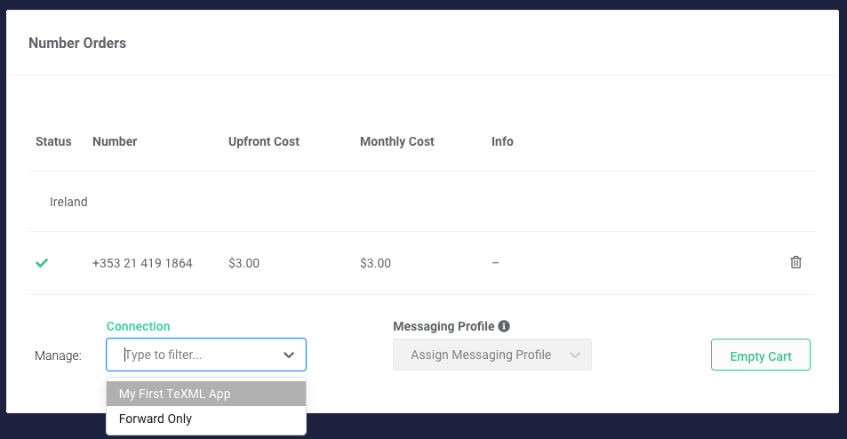

| [Overview](./VP1.md)  | [Telnyx Prerequisites](./VP2.md) | [Symbl Prerequisites](./VP3.md) | [Telnyx Call Control Conferencing Application](./VP4.md) | [Symbl <-> Telnyx Sentiment IVR](./VP5.md) | [What's Next?](./VP6.md)
| :---: | :---: | :---: | :---: | :---: | :---: |

# AI IVR Workshop

## Telnyx Prerequisites
Call Control is an API built by Telnyx that allows you to control phone calls with code. Businesses all over the world use Call Control to build contact center applications, call tracking tools, conversational AI and voice analytics programs, and more.

When we first built our Programmable Voice API, we named it Call Control in honor of a classic telephony concept, calling on our years of telephony experience and our global Tier-1 telephony network.

Voice APIs allow you to make, manage and route calls globally to any device — phone, app or browser. At Telnyx, we go several steps further, enabling real-time media analysis, answering machine detection and advanced conferencing, among a plethora of other powerful features.
***
In this step, you’ll learn how to get started with Telnyx Call Control within the Telnyx Portal and get everything you need! In these simple steps we will:

1. Sign up for a <strong>Telnyx account</strong>.
2. Create an <strong>application</strong> to configure how you connect your calls.
3. Buy or port a <strong>phone number</strong> to receive inbound calls, and assign this number to your new application.
4. Create an <strong>outbound voice profile</strong> to make outbound calls, and assign your application to this new profile.
5. Take note of your:
    * [API Key](https://portal.telnyx.com/#/app/api-keys)
    * [Public Key](https://portal.telnyx.com/#/app/api-keys/public-key)
    * [Call Control ID](https://portal.telnyx.com/#/app/call-control/applications) of the application you just created
***

## Sign Up for a Telnyx Mission Control Portal account

Head to [telnyx.com/sign-up](https://telnyx.com/sign-up) to sign up for your free Telnyx account. It’ll give you access to our Mission Control Portal where you can buy phone numbers, set up and manage Call Control Applications, and much more.

## Step 1: Create a Call Control or TeXML application

* Select ["Call Control"](https://portal.telnyx.com/#/app/call-control/applications) on the left-hand navigation menu
  * Click <strong>Add New App</strong> to create an application to control calls via API.
* Call Control and TeXML applications work by sending and receiving [webhooks](/docs/v2/development/api-guide/webhooks). For testing purposes, you can set the webhook URL to an endpoint you create at [https://hookbin.com](https://hookbin.com). (Later on we will be using <strong>ngrok</strong> instead to tunnel our localhost)
* Don't worry about the other settings for now - you can always come back and edit these later when following our other tutorials. Scroll down and hit <strong>Save</strong> to finish creating your application.

## Step 2: Buy a phone number and assign it to the application

You can search for, buy, and provision new numbers, or port existing numbers - all within the Numbers section of the [Telnyx Portal](https://portal.telnyx.com/#/app/numbers/search-numbers).

Simply click on "Numbers", then either "Search & Buy Numbers" or "Port Numbers" and follow the prompts.

> You can also do this programmatically via our **RESTful API**. Check out our documentation for number [searching](/docs/api/v2/numbers/Number-Search#listAvailablePhoneNumbers), [ordering](/docs/api/v2/numbers/Number-Orders#createNumberOrder), and [assigning numbers to connections or applications](/docs/api/v2/numbers/Number-Configurations#updatePhoneNumber).

You can assign your new number to an application at checkout. Simply select your application in the <strong>Assign Connection</strong> dropdown.

If you already own a number or have ported a number to Telnyx, you can also assign it to your new application from the **My Numbers** view in the portal.

## Step 3: Create an Outbound Voice Profile

To build applications that can make outbound calls, you must first create an **Outbound Voice Profile** and assign your application to it.

Select ["Outbound Voice Profiles"](https://portal.telnyx.com/#/app/outbound-profiles) on the left-hand navigation menu, click **Add New Profile** and set up your profile name. Add the application you just created above in the <strong>Associated Connections and Applications</strong> section. In the <strong>Traffic Type </strong>section, you must specify at least one destination to allow for outbound calls. This should already be automatically filled with "North America", but you can add other destination as you please. Hit **Save** to finish creating your profile.

> You can also do this programmatically via our **RESTful API**. Check out our documentation for [Outbound Voice Profiles](/docs/api/v2/outbound-voice-profiles).

 

That’s it! You're all set to start integrating Telnyx with your applications. 

## Where to next?

If you'd prefer to start building with our RESTful APIs directly, check out our guide to [setting up your development environment](/docs/v2/development/dev-env-setup). After you're set up, you can learn how to [send commands](/docs/v2/call-control/sending-commands) and [receive webhooks](/docs/v2/call-control/receiving-webhooks).

Otherwise, you are now ready to [proceed to the next step](./VP3.md)!