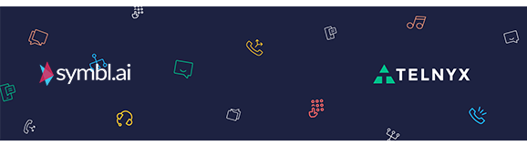
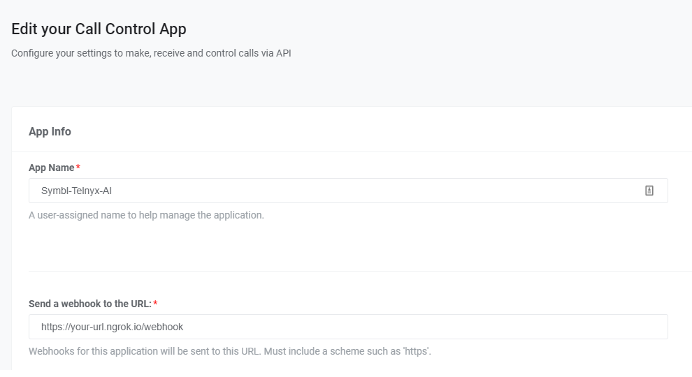

| [Overview](./README.md)  | [Telnyx Prerequisites](./VP2.md) | [Symbl Prerequisites](./VP3.md) | [Telnyx Call Control Conferencing Application](./VP4.md) | [Symbl <-> Telnyx Sentiment IVR](./VP5.md) | [What's Next?](./VP6.md)
| :---: | :---: | :---: | :---: | :---: | :---: |

# AI IVR Workshop

## Telnyx Call Control Conferencing Application

The application that we are trying to construct will have a functional "skeleton" of a basic conferencing application. We are using conferencing in this case as a straightforward way for Symbl to connect to the session via PSTN (ie. regular phone call) with as little disruption as possible for the Caller. 

> A subset of the operations available in the Call Control API is the [Call Control Conference](/docs/api/v2/call-control/Conference-Commands) API. This allows the user (you) to create and manage a conference programmatically upon receiving an incoming call, or when initiating an outgoing call.

The call ultimately will represent this flow:

Caller calls Telnyx Number ---> [Our Application] --> [Create Conference] --> Caller Joins Conference

From here on out, any call that comes into that number and hits our application will ultimately arrive at the initial conference automatically.

So lets construct this base conferencing application using Python!

> The [Telnyx Python Library](https://github.com/team-telnyx/telnyx-python) is a convenient wrapper around the Telnyx REST API. It allows you to access and control call flows using an intuitive object-oriented library. This tutorial will walk you through creating a simple Flask and Ngrok server application that allows you to create and manage a conference.

## Setup

Before you get started, make sure you have successfully set up a Mission Control Portal Account, purchased a number and connected that number to a [Call Control Application](https://portal.telnyx.com/#/app/call-control/applications). You can learn how to do that in the [Telnyx Prerequisite](/docs/v2/call-control/quickstart) section.

* make sure the *Webhook API Version* is **API v2**

You’ll also need to have `python` installed to continue. You can check this by running the following:

```bash
$ python3 -v
```

Now in order to receive the necessary webhooks for our IVR, we will need to set up a server. For this tutorial, we will be using [Flask](https://palletsprojects.com/p/flask/), a micro web server framework. A quickstart guide to flask can be found on their [official website](https://flask.palletsprojects.com/en/2.0.x/). For now, we will install flask using pip.

```bash
$ pip install flask
```

You can get the full set of available Telnyx Call Control Commands [here](/docs/api/v2/overview).
You can also find the Conference Commands [here](https://developers.telnyx.com/docs/api/v2/call-control/Conference-Commands)

For each Telnyx Call Control Command we will be using the Telnyx Python SDK. To execute this API we are using Python `telnyx`, so make sure you have it installed. If not you can install it with the following command:

```bash
$ pip install telnyx
```

After that you’ll be able to use ‘telnyx’ as part of your app code as follows:

```python
import telnyx
```

We will also import Flask in our application as follows:

```python
from flask import Flask, request, Response
```

And set our api key using the Python telnyx SDK:

```python
telnyx.api_key = "YOUR_TELNYX_API_KEY"
```

## Server Setup

Flask is a great application for setting up local servers. However, in order to make our code public to be able to receive webhooks from Telnyx, we are going to need to use a tool called ngrok. Installation instructions can be found [here](https://developers.telnyx.com/docs/v2/development/ngrok). 

Now to begin our flask application, underneath the import and setup lines detailed above, we will add the following:

```python
app = Flask(__name__)
 
@app.route('/webhook', methods=['POST'])
def respond():
	//Our code for handling the call control application will go here
	print(request.json[‘data’])
return Response(status=200)
```

This is the base Flask application code specified by their [documentation](https://palletsprojects.com/p/flask/). This is the minimum setup required to receive webhooks and manipulate the information received in json format. To complete our setup, we must run the following to set up the Flask environment (note YOUR_FILE_NAME will be whatever you .py file is named):

```bash
$ export FLASK_APP=YOUR_FILE_NAME.py
```

Now, we are ready to serve up our application to our local server. To do this, run:

```bash
$ flask run
```

A successful output log should look something like:

```bash
 * Serving Flask app "main"
 * Running on http://127.0.0.1:5000/ (Press CTRL+C to quit)
```
## Webhook Setup

From the above steps, we are now successfully running our Flask application on our local server. The key word here is *local*. To have Telnyx send us json response webhooks, we will need to tunnel out and have our **local** server be accessible to the **public**.

In this case we can use a program called **ngrok** to do this. You can install ngrok by visiting their [site](https://ngrok.com/download). 

You can then run the following command wherever the ngrok executable is located (NOTE you may have to open another terminal window or push the Flask process to the background): 

```bash
$ ./ngrok http 5000
```

This sets up a tunnel on **port 5000**. You response should look something like:

```bash
ngrok by @inconshreveable                                                                                                                               (Ctrl+C to quit)

Session Status                online
Account                       Little Bobby Tables (Plan: Free)
Version                       2.3.35
Region                        United States (us)
Web Interface                 http://127.0.0.1:4040
Forwarding                    http://your-url.ngrok.io -> http://localhost:5000
Forwarding                    https://your-url.ngrok.io -> http://localhost:5000

Connections                   ttl     opn     rt1     rt5     p50     p90
                              0       0       0.00    0.00    0.00    0.00
```


Once this is up and running, you should see the **Forwarding** URL in the command logs or located on the [ngrok dashboard page](https://dashboard.ngrok.com/status/tunnels). This url is important because it will be where our Call Control Application will be sending webhooks to. 

Grab this url and head on over to the Telnyx Dashboard page, navigate to your [Call Control Application](https://portal.telnyx.com/#/app/call-control/applications) and add the URL to the section labeled "Send a webhook to the URL" as shown below. Add the ngrok url to that section and we are all set up to start our IVR!

**Ensure that you append '/webhook' to the ngrok url as specified in our Flask Application**



## Receiving and Interpreting Webhooks

We will be configuring our respond function to handle certain incoming webhooks and execute call control commands based on what the values are. Flask catches the incoming webhooks and calls the respond() function every time a webhook is sent to the route we specified as ‘/webhook’. We can see the json value of the hook in the request.json object. Here is what a basic Telnyx Call Object looks like

```
{
	'data': {
		'event_type': 'call.initiated',
		'id': 'a2fa3fa6-4e8c-492d-a7a6-1573b62d0c56',
		'occurred_at': '2020-07-10T05:08:59.668179Z',
		'payload': {
			'call_control_id': 'v2:rcSQADuW8cD1Ud1O0YVbFROiQ0_whGi3aHtpnbi_d34Hh6ELKvLZ3Q',
			'call_leg_id': '76b31010-c26b-11ea-8dd4-02420a0f6468',
			'call_session_id': '76b31ed4-c26b-11ea-a811-02420a0f6468',
			'caller_id_name': '+17578390228',
			'client_state': None,
			'connection_id': '1385617721416222081',
			'direction': 'incoming',
			'from': '+14234567891',
			'start_time': '2020-07-10T05:08:59.668179Z',
			'state': 'parked',
			'to': '+12624755500'
		},
		'record_type': 'event'
	},
	'meta': {
		'attempt': 1,
		'delivered_to': 'http://59d6dec27771.ngrok.io/webhook'
	}
}
```

We want to first check and see if the incoming webhook is an event. To check that, we need to look at the record_type using the following check:

```python
def respond():
	//Check record_type of object
	data = request.json['data']
    	if data.get('record_type') == 'event':
 
	print(request.json[‘data’])
return Response(status=200)
```

Then, we can check and see what kind of event it is. In the case of the example json above, the event is call.initiated. We can get that value using the following added code:

```python
def respond():
	//Check record_type of object
	data = request.json['data']
    	if data.get('record_type') == 'event':
		//Check event type
		event = data.get('event_type')
        	print(event, flush=True)
        	if event == "call.initiated":
            	print("Incoming call", flush=True)
 
	print(request.json[‘data’])
return Response(status=200)
```

As you can see, this check will print out “incoming call” whenever a call.initiated event is received by our application. We can even test it by giving the Phone Number associated with our Call Control Application a call! Now we can start to implement some commands in response to this webhook.

## Receiving Webhooks & Creating a Conference

Below is the logic that will go inside our respond() function. When we receive a webhook, we extract the data from `request.json.get('data')` and we look at the `event_type` inside that object to determine a course of action.

```python
calls = []
conference = None

class call_info:
    call_control_id: ''
    call_leg_id: ''

@app.route('/webhook', methods=['POST'])
def respond():

    # Activate global calls array
    global calls
    global conference

    # Get the data from the request
    data = request.json.get('data')
    # Check record_type
    if data.get('record_type') == 'event':
        # Check event type
        event = data.get('event_type')
        if event == "call.initiated":
            # Extract call information and store it in a new call_info() object
            new_call = call_info()
            new_call.call_control_id = data.get('payload').get('call_control_id')
            new_call.call_leg_id = data.get('payload').get('call_leg_id')
            calls.append(new_call)
            # Answer the call
            print(telnyx.Call.answer(new_call), flush=True)

        # When the call is answered, find the stored call and either add it 
        # to the conference or create a new one if one is not yet created
        elif event == "call.answered":
            call_id = data.get('payload').get('call_control_id')
            call_created = call_info()
            call_created.call_control_id = call_id

            for call in calls:
                if call.call_control_id == call_id:
                    if not conference:
                        conference = telnyx.Conference.create(beep_enabled="always",call_control_id=call_id, name="demo-conference")
                    else:
                        conference.join(call_control_id=call_id)
        
        # When a caller hangs up, remove that caller from the global calls array
        elif event == "call.hangup":
            call_id = data.get('payload').get('call_leg_id')
            for call in calls:
                if call.call_leg_id == call_id:
                    calls.remove(call)
    return Response(status=200)
```

Pat youself on the back - that's a lot of code to go through! Now let's break it down even further and explain what it does. 

First, we create an array for keeping track of the ongoing calls and define a variable for storing the conference object. Then, we create a small object class for call_info, containing the call_control_id and call_leg_id. This will be useful for searching for calls in our calls array later, as well as using Conference Commands with those objects.

```python
calls = []
conference = None

class call_info:
    call_control_id: ''
    call_leg_id: ''
```

Next, we parse the data from our webhook in the respond() function. We first declare our global variables inside of the function so that the scope is consistent. Then, we extract the data from the reponse and check to ensure the `record_type` is `event`. Then, we extract the `event_type` itself and use logic to determine the action taken based on the `event`.

```python
@app.route('/webhook', methods=['POST'])
def respond():
    # Activate global calls array
    global calls
    global conference
    # Get the data from the request
    data = request.json.get('data')
    #print(data, flush=True) #For testing purposes, you could print out the data object received
    # Check record_type
    if data.get('record_type') == 'event':
        # Check event type
        event = data.get('event_type')
```

Here is where you will respond to a new call being initiated, which can be from either an inbound or outbound call. We create a new call_info() object and assign the `call_control_id` and `call_leg_id` from the incoming data. We then use `telnyx.Call.answer(new_call)` to answer the call. This will trigger a webhook event `call.answered` which we will handle below.

```python
# When call is initiated, create the new call object and add it to the calls array
        if event == "call.initiated":
            # Extract call information and store it in a new call_info() object
            new_call = call_info()
            new_call.call_control_id = data.get('payload').get('call_control_id')
            new_call.call_leg_id = data.get('payload').get('call_leg_id')
            calls.append(new_call)
            # Answer the call
            print(telnyx.Call.answer(new_call), flush=True)
```

On the `call.answered` event, retrieve the stored call created during the `call.initiated` event. Then, either create a new conference if this is the first call and there isn't a conference running yet, or add the call to an existing conference. Note that a `call_control_id` is required to start a conference, so there must aready be an existing call before you can create a conference, which is why we create the conference here.

```python
# When the call is answered, find the stored call and either add it 
        # to the conference or create a new one if one is not yet created
        elif event == "call.answered":
            call_id = data.get('payload').get('call_control_id')
            call_created = call_info()
            call_created.call_control_id = call_id

            for call in calls:
                if call.call_control_id == call_id:
                    if not conference:
                        conference = telnyx.Conference.create(beep_enabled="always",call_control_id=call_id, name="demo-conference")
                    else:
                        conference.join(call_control_id=call_id)
```

## Conclusion

Congratulations! You have now constructed a conferencing application. Once this is setup and running, you will be able to call into your purchased Telnyx number, a conference will be automatically created and you will be transfered into it. Now, every new call to your purchased number will automatically forward to this conference by itself! Try it out! 

Feel free to reach out to us on [Slack](https://joinslack.telnyx.com/) for any questions in the creation of this project!

Otherwise, let's [proceed to the next step](./VP5.md).
