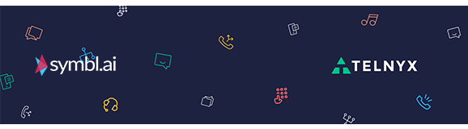

| [Overview](./README.md)  | [Telnyx Prerequisites](./VP2.md) | [Symbl Prerequisites](./VP3.md) | [Telnyx Call Control Conferencing Application](./VP4.md) | [Symbl <-> Telnyx Sentiment IVR](./VP5.md) | [What's Next?](./VP6.md)
| :---: | :---: | :---: | :---: | :---: | :---: |

# AI IVR Workshop

## What's Next?

**The world's your oyster!**

### Telnyx Afterword
You can use Telnyx to create multifunctional applications of all sorts of shapes and sizes. We offer API support to every feature that we own, from which you can create apps from automating Phone Number purchasing to Faxing Applications to full fledged Skype/Zoom-like WebRTC interfaces! Take a look at our recently featured [Verification Learn and Build](https://portal.telnyx.com/#/app/verify/learnAndBuild) to even build out your own 2FA system. We pride ourselves with having a robust feature set that is not only expansive but easy to use.

Check out these resources for more documentation and examples of other code bases as well as fully completed demo-apps to spark your interest!

* https://developers.telnyx.com/docs/v2/call-control/tutorials
* https://developers.telnyx.com/docs/v2/verify/quickstart
* https://github.com/team-telnyx/demo-python-telnyx
* https://github.com/team-telnyx/demo-node-telnyx
* https://github.com/team-telnyx/demo-php-telnyx
* https://github.com/team-telnyx/demo-ruby-telnyx
* https://github.com/team-telnyx/demo-dotnet-telnyx
* https://github.com/team-telnyx/demo-java-telnyx

If you have any developer related questions, feel free to reach out to us on [Slack](https://joinslack.telnyx.com/) or straight from the portal by clicking the chat icon on the bottom right.

### Symbl Afterword

With Symbl.ai you have the power to connect, visualize or transfer your conversation data. The next step is to extend your programmable intelligence beyond merely automatically intelligent transfers to a persistent, omnichannel, contextual, artificially intelligent calling experience or Computer Telephony System. After onboarding the agent, your Symbl.ai `conversationId` doesn’t change. In addition, Symbl.ai’s Tracker’s API is a feature extension for adding detection of words directly. 

Imagine, for instance, that you are an administrator with a Computer Telephony Interface. You have a batch of recorded calls where the rapid decline in sentiments over messages caused your application’s logic to transfer calls automatically to a live operator. You would like to know what topics correspond to the topics within which the rapid decline of sentiments occurs, the frequency or the time from start to transfer. With Symbl.ai’s Python SDK you are empowered to transform your analysis of calls on an end to end basis, both providing the Conversation Intelligence with which to program intelligent transfers as well as program an entire interface for analyzing the calls straight out of the box.

[Symbl.ai](Symbl.ai) invites developers to reach out to us via email at [`developer@symbl.ai`](mailto:developer@symbl.ai), join our [Slack](https://join.slack.com/t/symbldotai/shared_invite/zt-4sic2s11-D3x496pll8UHSJ89cm78CA?utm_source=dev.to&utm_medium=referral&utm_campaign=devrel) channels, participate in our [hackathons](developer.symbl.ai/hackathon?utm_source=dev.to&utm_medium=referral&utm_campaign=devrel), fork our [Postman public workspace](https://www.postman.com/symbldotai/workspace/symbl-ai/overview?utm_source=dev.to&utm_medium=referral&utm_campaign=devrel), or `git clone` our repos at (https://github.com/symblai?utm_source=dev.to&utm_medium=referral&utm_campaign=devrel)